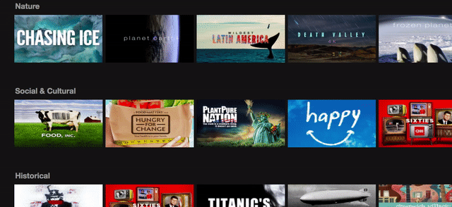
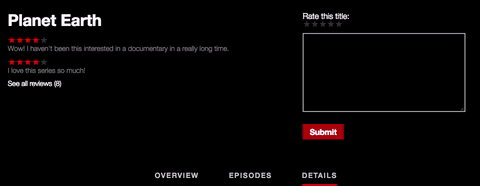

# Docflix

[Docflix Live](http://docflix.us)

## Description
Docflix is a video-streaming web application inspired by Netflix that features short, 1-to-3-minute clips of popular documentaries. The back end was built with Ruby on Rails and PostgreSQL. The front end was created with React.js and JavaScript.

## Features & Implementation

### Welcome View


### User Authentication
Built from the ground up, front-end and back-end user authentication encrypts user passwords and creates a unique session token for each user on signup or login. This allows for both secure access and the ability to customize content (like My List and Review functionality) based on the current user.

### Browse
On login, users are taken to the main index, which features a nearly fullscreen video component. Below, users can browse through each genre's shows via the react-slick carousel component. Show thumbnails expand on hover. Each show can have multiple genres and each genre multiple shows; they are connected to each other through a join table.

### Series Show

When a user clicks on a documentary's thumbnail, that series will expand to show the overview, episodes, and reviews. In order to implement opening and closing of the series display under the correct genre, I added `clickedGenre: null` and `clickedSerie: null` to the genre index page's state. On click, the `null` values are replaced by the selected series and the genre under which that series is clicked.

```  
serieExpand(serie, genre) {
    return () => {
      this.setState({
        clickedSerie: serie,
        clickedGenre: genre
      });
    };
  }
```

This updates the state, which in turn adds a Series Show component under the clicked genre:

```
<ul className='genre-list'>
  ...
  { this.seriesList(genre) }
  if (this.state.clickedGenre && genre.id === this.state.clickedGenre.id) {
    <SerieShowContainer />
  }
  ...
</ul>
```

### Watching Videos
Videos and thumbnails are hosted in the cloud using Amazon Web Services and stored through `thumbnail_url` for thumbnails and `video_url` for videos. Videos are played via the native HTML5 video player.

### Reviews


Users can create, read, update, and delete their reviews, which update instantly.

### My List
Users can add and remove docs from their list, which will then be displayed as the first 'Genre' on the home page. If the doc has not yet been added, a white plus sign will appear on the documentary show page. If it has already been added, a white check mark will be show instead. Users can add and remove docs from their list instantly.

## Future Directions for this Project
- [ ] Search
- [ ] Genre show page
- [ ] Review helpfulness
