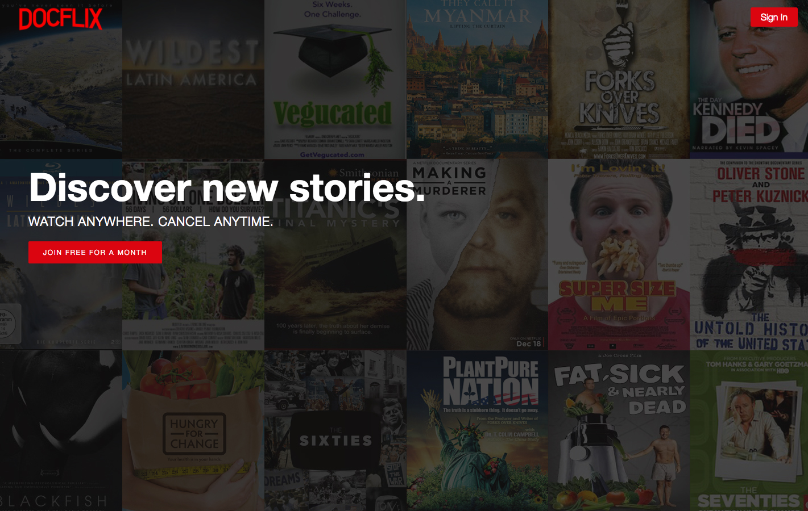
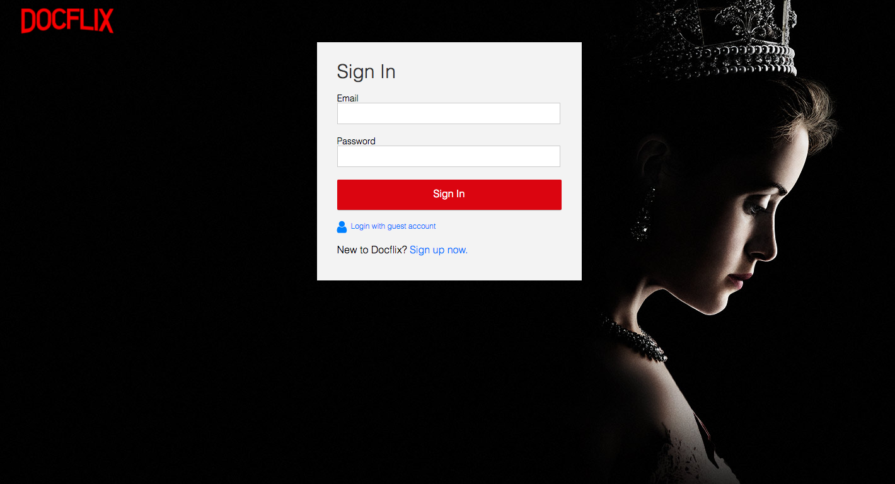
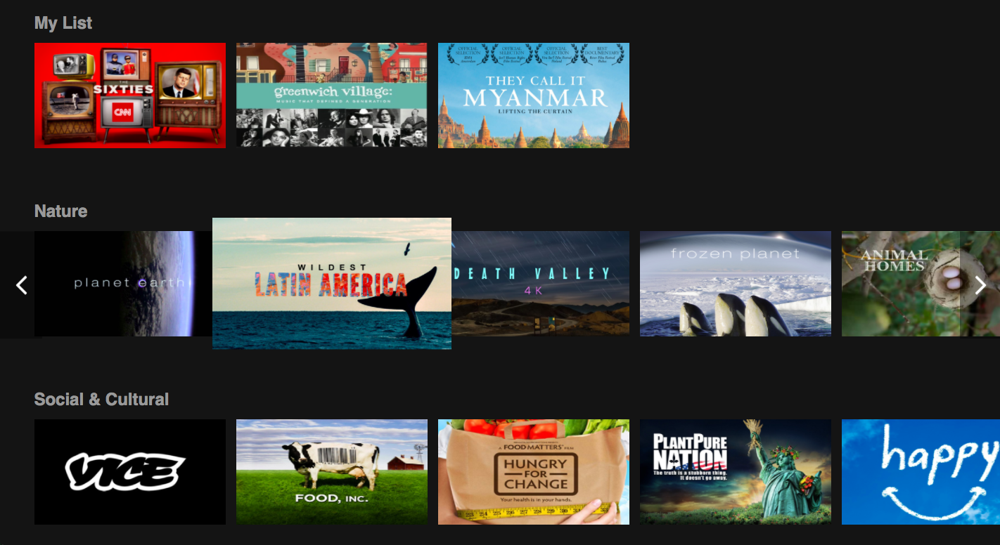
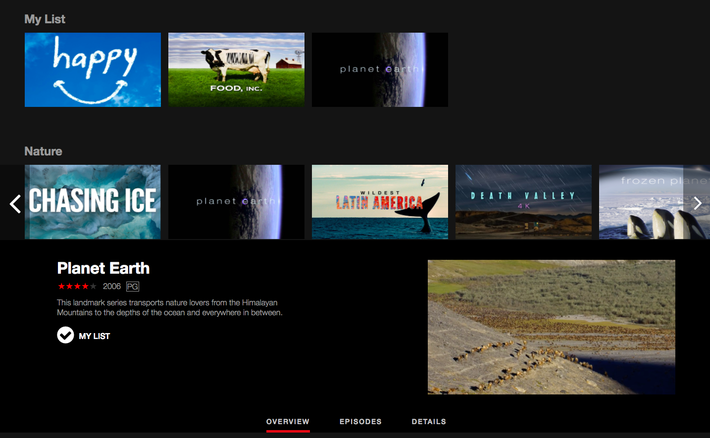
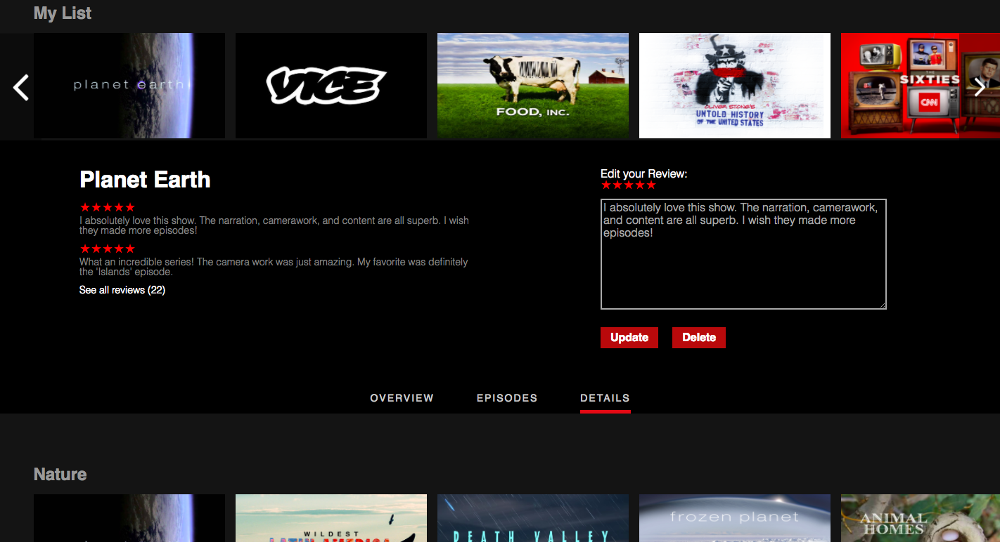

# Docflix

[Docflix Live](http://doclix.herokuapp.com)

## Description
Docflix is a video-streaming web application inspired by Netflix that features short, 30-second to 3-minute clips of popular documentaries. The back end was built with Ruby on Rails and PostgreSQL. The front end was created with React.js and JavaScript, and utilizes Redux to craft a seamless single-page UX.

## Features & Implementation

### Welcome View

### User Authentication

### Genres

### Series

### Reviews

### My List

## Future Directions for this Project
- [ ] Search
- [ ] Genre show page
- [ ] Review helpfulness
