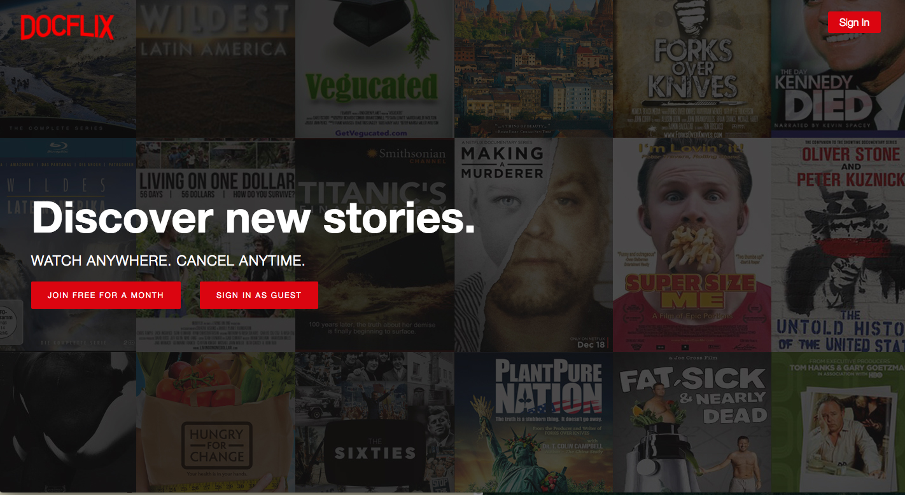

# Docflix

[Docflix Live](http://doclix.herokuapp.com)

## Description
Docflix is a video-streaming web application inspired by Netflix that features short, 30-second to 3-minute clips of popular documentaries. The back end was built with Ruby on Rails and PostgreSQL. The front end was created with React.js and JavaScript, and utilizes Redux to craft a seamless single-page UX.

## Features & Implementation

### Welcome View

### User Authentication

Built from the ground up, front-end and back-end user authentication encrypts user passwords and creates a unique session token for each user on signup or login. This allows for both secure access and the ability to customize content (like My List and Review functionality) based on the current user.

### Browse

On login, users are taken to the main index, which has nearly full screen featured video component. Below, users can browse through each genre's shows via the react-slick carousel component. Show thumbnails expand on hover. Each show can have multiple genres and each genre multiple shows; they are connected to each other through a join table. 

### Series

When a user clicks on a show's thumbnail, that series will expand to show the overview, episodes, and reviews. If the show is just a single documentary, there will not be an 'episodes' tab to select. If it is a series, the episodes tab will contain a react-slick carousel component, allowing users to scroll through episodes.

### Watching Videos
Videos are hosted in the cloud using Amazon Web Services and displayed with the native HTML5 video player.

### Reviews

### My List

## Future Directions for this Project
- [ ] Search
- [ ] Genre show page
- [ ] Review helpfulness
